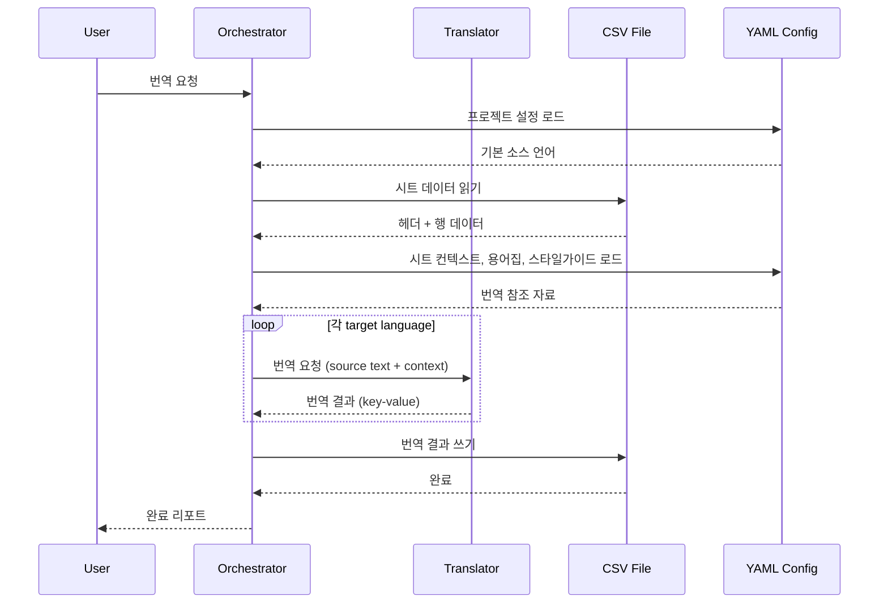

# Game Translation Agent

## Goal

Google ADK 기반 멀티 에이전트 시스템으로, CSV 파일의 게임 텍스트를 다국어로 번역/검수한다.

## Tech Stack

- **Agent Framework**: Google ADK — because Gemini 네이티브 지원, 멀티 에이전트 내장
- **LLM**: Gemini — because ADK 통합, 다국어 번역 품질 충분
- **Sheet Storage**: 로컬 CSV 파일 (`projects/<name>/sheets/*.csv`) — because 외부 서비스 의존 없이 로컬에서 직접 읽기/쓰기 가능
- **Config**: YAML — because 사람이 읽고 편집 가능, 별도 DB 불필요

## Agent Roles

- **Orchestrator** (root_agent): 사용자 요청을 해석하고 하위 에이전트에게 분배. 직접 번역하지 않음.
- **Translator** (sub_agent): 용어집과 스타일가이드를 참조하여 번역 수행. 시트별 컨텍스트 오버라이드 반영.
- **Reviewer** (sub_agent): 번역 결과의 품질 검수. 플레이스홀더 보존, 용어집 준수, 톤 일관성 확인.

Sheet 읽기/쓰기는 에이전트가 아닌 **공유 도구**로 처리 — because 상태 없는 CRUD 작업에 에이전트 오버헤드 불필요.

## Tools

- **CSV 읽기/쓰기 도구**: 프로젝트의 시트 데이터를 읽고 번역 결과를 쓴다.
- **프로젝트/시트 설정 로드 도구**: 프로젝트 설정과 시트별 컨텍스트 오버라이드를 로드한다.
- **용어집/스타일가이드 로드 도구**: 프로젝트별 YAML에서 번역 참조 자료를 로드한다.

## Workflows

- **translate**: 시트 전체 읽기 → 모든 대상 언어로 번역 → 결과 쓰기
- **update**: 지정된 키만 읽기 → 해당 키만 번역 → 결과 쓰기
- **review**: 시트 전체 읽기 → 품질 검수 → 리포트 생성

### Translate 워크플로우 (시퀀스)

## Architectural Decisions

- **로컬 CSV 파일로 시트 관리** — because 외부 서비스(Google Sheets) 의존을 제거하고, 인증 없이 로컬에서 바로 동작. CSV 파일 구조는 기존 스프레드시트와 동일 (`key, Language(code)` 헤더).
- **소스 언어 유동적** — because 게임 개발에서 영어 외 언어가 원문일 수 있음 (시트 헤더에서 자동 감지)
- **전체 언어 자동 번역** — because 타겟 언어를 매번 수동 선택하는 것은 비효율적
- **프로젝트별 용어집/스타일가이드** — because 게임마다 고유 용어와 톤이 다름. YAML로 프로젝트 디렉토리에 저장.
- **시트별 컨텍스트 오버라이드** — because 같은 프로젝트 내에서도 시트마다 번역 맥락이 다를 수 있음 (UI 텍스트 vs 스토리 vs 튜토리얼). 소스 언어, 번역 스타일, 용어집 오버라이드, 글자수 제한, 자유 지시사항 설정 가능.

## Constraints

- Must: 플레이스홀더 ({0}, {1}, {player_name} 등) 원본 그대로 보존
- Must: 스프레드시트 헤더에서 언어 코드 자동 감지 (예: `Japanese(ja)` → `ja`)
- Must not: 소스 언어 컬럼을 수정하지 않을 것
- Must not: 에이전트가 도구 없이 CSV 파일에 직접 접근하지 않을 것

## Scope

**In scope (v0)**: CLI를 통한 translate/update/review 실행, 프로젝트별 설정 관리
**Out of scope**: 번역 메모리, 자동 용어 추출, 번역 품질 점수화

## v0 이후 검토 방향 (확정 아님 — v0 사용 경험 후 결정)

- 번역 메모리 / 캐시
- 자동 용어집 추출 (번역 결과에서 반복 패턴 감지)
- 번역 품질 점수화 (정량적 메트릭)
- 병렬 번역 (여러 시트 동시 처리)
- Google Sheets 연동 (MCP 또는 API 직접 사용)
