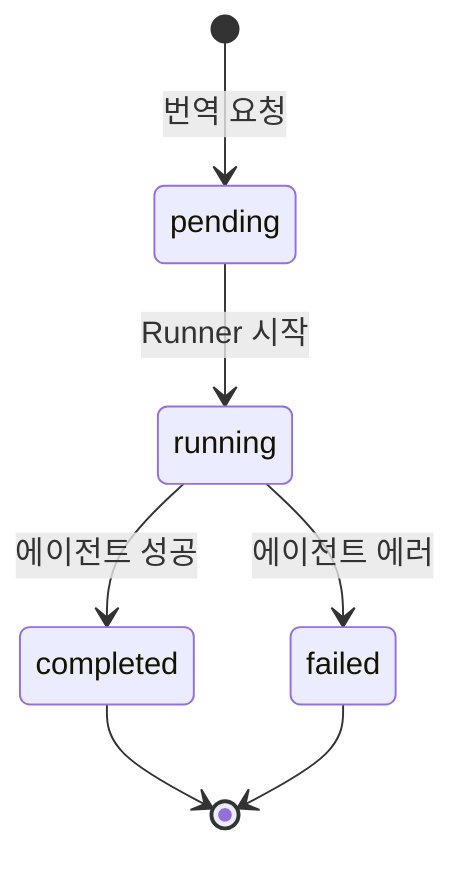
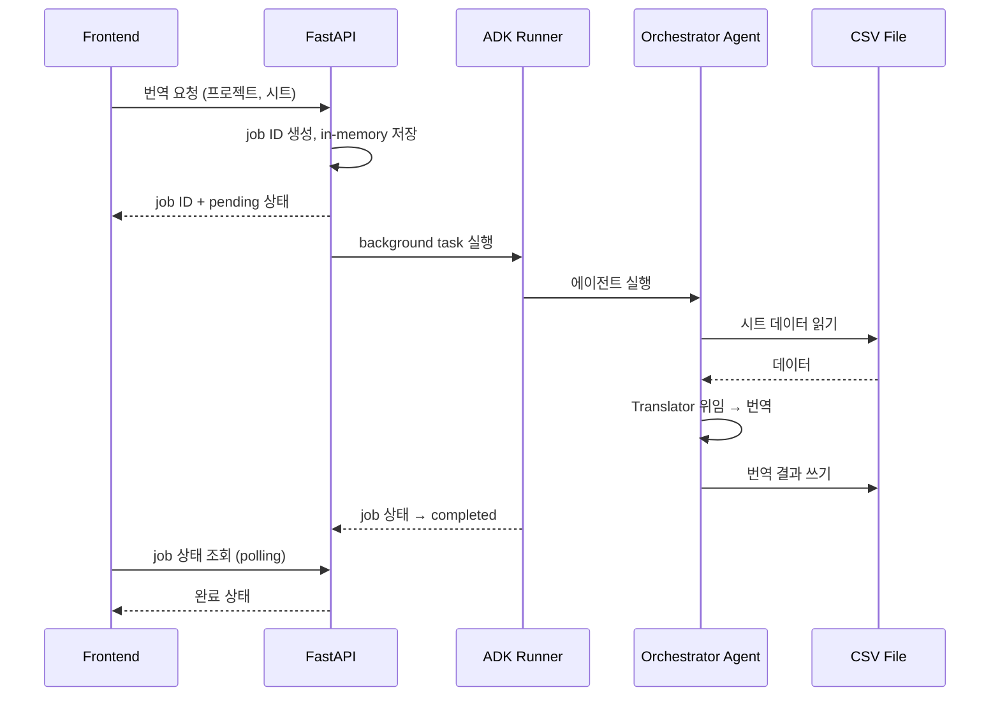
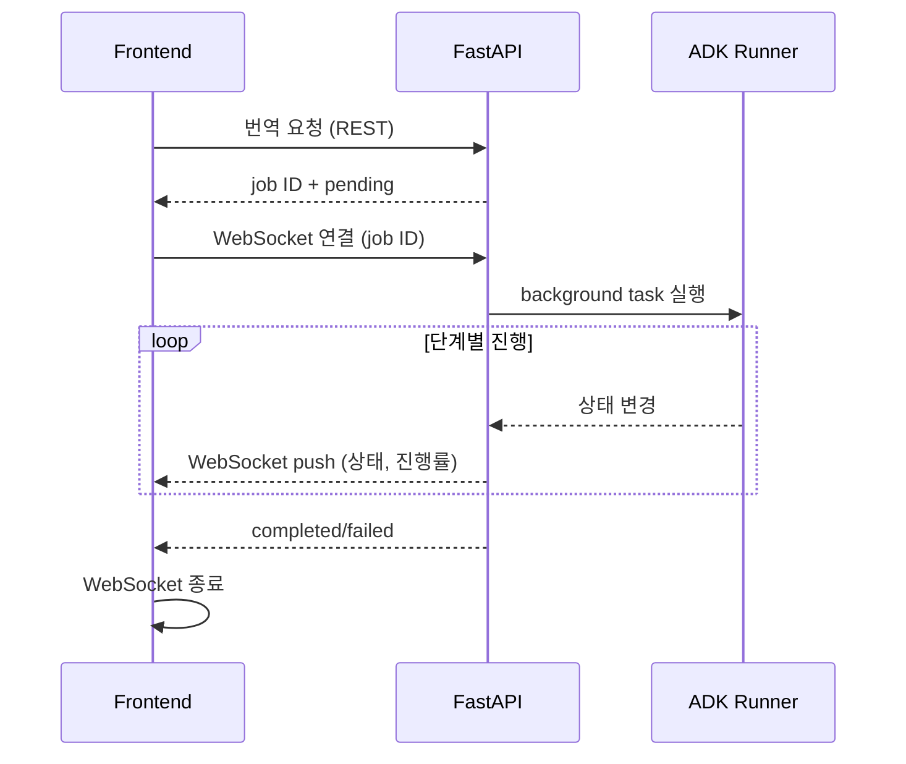

# Backend API

## Goal

FastAPI 서버로 에이전트 실행을 래핑하고, 프로젝트/설정 관리 API를 제공한다.

## Tech Stack

- **Framework**: FastAPI — because Python 에이전트와 동일 런타임, async 지원
- **Data**: 파일 시스템 (YAML + CSV) — because v0에서 DB 불필요, 프로젝트 디렉토리 구조로 충분

## API Groups

- **Projects**: 프로젝트 CRUD, 목록 조회
- **Sheets**: 로컬 CSV 파일에서 시트 생성/목록/데이터 조회/수정/삭제, 행(key) 추가/일괄 삭제
- **Translation**: 번역/업데이트/검수 작업 트리거 + 상태 조회 + 결과
- **Config**: 용어집(glossary.yaml CRUD), 스타일가이드, 시트별 컨텍스트 관리
- **Languages**: 프로젝트 레벨 언어 추가/삭제 (config.yaml `languages` 관리 + 전체 시트 CSV 컬럼 동기화), 시트별 표시 언어 설정

## Architectural Decisions

- **비동기 job 모델** — because 대량 시트 번역은 시간이 오래 걸림. 요청 즉시 job ID 반환, 프론트엔드에서 상태 폴링.
- **In-memory Job 관리 (v0)** — because v0에서 Job 이력 영속화 불필요. 서버 재시작 시 소멸 허용.
- **ADK Runner + DatabaseSessionService (SQLite)** — because 에이전트 대화 히스토리를 영속 저장하여 서버 재시작 후에도 세션 유지. Runner가 SessionService를 주입받아 에이전트를 실행.
- **파일 기반 프로젝트 설정** — because v0에서 DB 도입 불필요. `projects/<name>/` 디렉토리에 config.yaml, glossary.yaml, style_guide.yaml 저장.
- **용어집 데이터 모델: 1항목 = source + target + language + context** — because 용어집은 에이전트가 참조하는 번역 사전이며, context(사용 맥락: "전투 UI 전용", "고유명사" 등)가 에이전트의 상황별 용어 선택에 핵심. 시트처럼 다국어 컬럼 구조가 아니라 언어별 개별 항목으로 저장하여 항목마다 context를 부여. glossary.yaml에 `[{id, source, target, language, context?}]` 형태로 저장.
- **로컬 CSV 파일로 시트 관리** — because 외부 서비스 의존 없이 `projects/<name>/sheets/*.csv` 파일을 직접 읽기/쓰기. 시트 수(sheet_count)는 CSV 파일 개수에서 동적으로 산출.
- **시트 생성 시 프로젝트 `languages` 설정에서 헤더 생성** — because 프로젝트 config.yaml에 정의된 언어 목록이 정식 기준이므로, 새 시트 생성 시 이 목록에서 CSV 헤더를 생성.
- **행(key) 단위 추가/삭제 지원** — because 시트에 새 번역 키를 추가하거나 불필요한 키를 제거하는 것이 번역 데이터 관리의 기본 작업.
- **행 일괄 삭제** — because 여러 키를 한 번에 삭제하는 경우가 빈번하므로, 단건 삭제보다 일괄 삭제가 효율적.
- **시트 설정을 프로젝트 config.yaml에 시트별 섹션으로 저장** — because 시트마다 개별 파일을 만들면 파일 수가 늘어나고, 하나의 config.yaml에서 프로젝트 전체 설정을 관리하는 기존 패턴과 일관성 유지.
- **프로젝트 기본값 상속, 시트별 오버라이드만 저장** — because 대부분의 시트가 동일한 번역 설정을 공유하므로, 프로젝트 레벨 기본값을 두고 시트별로 다른 값만 오버라이드하는 것이 효율적.
- **소스 언어 변경 시 기존 번역 데이터 유지** — because 소스 언어 변경은 "어떤 언어를 원문으로 볼 것인가"의 메타데이터 변경이지, 기존 번역 데이터를 무효화할 이유가 없음.
- **Unity Localization CSV 포맷 준수** — because 이 시스템의 CSV는 Unity Localization 테이블과 직접 호환되어야 함. Key 열은 대문자 `Key`, locale 헤더는 `Label(code)` 형식 (예: `English(en)`, `Chinese (Simplified)(zh-Hans)`). locale 코드에 하이픈 포함 가능. Id 열은 사용하지 않음.
- **프로젝트 레벨 언어 관리** — because 프로젝트가 지원하는 언어 목록이 전체의 기준이 되고, 시트는 그 부분집합을 사용. `config.yaml`의 `languages` 섹션에 `[{code, label}]` 형태로 저장.
- **시트별 표시 언어 관리** — because 시트마다 필요한 언어가 다를 수 있음. 기본은 프로젝트 전체 언어, 시트 설정에서 표시할 언어를 제한 가능. CSV 데이터는 유지하고 UI 표시만 제어.
- **프로젝트 언어 삭제 시 모든 시트 CSV에서 해당 열 삭제** — because 프로젝트에서 언어를 제거하면 해당 번역 데이터가 더 이상 필요 없음. 비가역적 작업이므로 확인 필요.

## Constraints

- Must: 번역 요청 시 즉시 job ID 반환 (blocking 금지)
- Must: 프로젝트 설정은 `projects/<name>/` 하위 YAML 파일로 관리
- Must: CSV 파일은 `projects/<name>/sheets/` 디렉토리에 저장
- Must not: 에이전트 내부 로직을 API 레이어에서 직접 구현하지 않을 것 (에이전트 호출만)
- Must not: 실행 중인 번역 job이 있는 시트를 삭제하지 않을 것
- Must not: 실행 중인 번역 job이 있는 시트의 행을 삭제하지 않을 것
- Must: 행 추가 시 중복 key 거부
- Must not: 소스 언어 변경 시 기존 번역 데이터를 삭제하거나 변경하지 않을 것
- Must: CSV Key 열은 대문자 `Key` 사용
- Must: locale 코드 파싱 시 하이픈 포함 코드 지원 (`zh-Hans`, `zh-TW`, `pt-BR` 등)
- Must: CSV에 중복 헤더 행이 있으면 에러 처리 (import 거부)
- Must not: CSV에 `Id` 열 사용하지 않을 것 — Key 기준으로 항목 식별
- Must: 프로젝트 언어 삭제 시 영향받는 시트 수와 번역 건수를 응답에 포함

## Flows

### Job 상태 전이

### 번역 요청 데이터 흐름 (시퀀스)

## Scope

**In scope (v0)**: 프로젝트 CRUD, CSV 시트 생성/조회/수정/삭제, 행(key) 추가/일괄 삭제, 번역 job 실행/상태, 설정 관리, 프로젝트 레벨 언어 관리 + 시트별 표시 언어
**Out of scope**: 인증, 멀티 유저, 작업 이력 저장

## Test Strategy

- **범위**: 서비스 레이어(CSV 읽기/쓰기 함수) + API 엔드포인트(FastAPI TestClient) — because 데이터 무결성은 서비스 레이어에서, HTTP 라우팅/에러 응답은 엔드포인트에서 각각 검증해야 함.
- **도구**: pytest + FastAPI TestClient — because 프로젝트 기존 테스트(`tests/test_glossary.py`)와 동일 도구 사용.
- **격리**: 각 테스트는 임시 디렉토리에서 CSV를 생성/조작 — because 테스트 간 상태 간섭 방지.

---

## v1 Additions

### Goal

v0의 폴링 기반 진행률을 WebSocket으로 전환하고, Job 이력을 영속 저장한다.

### Architectural Decisions (v1)

- **WebSocket으로 Job 진행률 전송** — because v0 폴링(1.5초)은 불필요한 요청을 반복하고 응답이 지연됨. 서버가 상태 변경 시 즉시 push.
- **Job 실행 중에만 WebSocket 연결** — because 항상 연결을 유지할 필요가 없음. 프론트엔드가 job 트리거 시 연결, 완료/실패 시 종료.
- **단계 기반 진행률 유지** — because v0에서 충분히 작동함. 전송 방식만 폴링→WebSocket으로 변경, 진행률 계산 로직은 동일.
- **Job 이력 SQLite 영속화** — because v0에서 서버 재시작 시 이력 소멸이 불편. 기존 aiosqlite 인프라 활용.
- **Job 이력 범위: 메타데이터만** — because 에이전트 응답 전체를 저장할 필요는 아직 없음. job ID, 타입, 상태, 시각, 에러만 저장.

### API Groups (v1 추가)

- **Job History**: 프로젝트별 과거 Job 이력 조회
- **WebSocket**: Job 진행률 실시간 전송

### Flows (v1)

#### WebSocket 진행률 흐름

### Constraints (v1 추가)

- Must: WebSocket 연결은 job 완료/실패 시 서버 측에서 종료 메시지 전송
- Must: 언어 삭제 시 해당 컬럼의 기존 데이터가 영구 삭제됨을 API 응답에 명시 (프로젝트 레벨 삭제 시)
- Must not: WebSocket을 job 진행률 외 용도로 사용하지 않을 것 (v1 범위)

### Scope (v1)

**In scope**: WebSocket 진행률, Job SQLite 영속화 + 이력 조회 API
**Out of scope**: 인증, 멀티 유저, 동시 작업 제한

---

## v2 Additions

### Goal

CSV 파일 업로드로 외부 번역 데이터를 기존 시트에 머지한다.

### Architectural Decisions (v2)

- **CSV 업로드는 key 기준 머지** — because 기존 시트에 새 key 추가 + 기존 key의 번역값 갱신이 가장 자연스러운 워크플로우. 전체 교체보다 데이터 손실 위험 적음.
- **업로드 데이터가 기존 값을 무조건 덮어씀** — because 업로드하는 CSV가 최신 번역이라는 사용자 의도가 명확. "빈 셀만 채우기" 옵션은 불필요한 복잡도.
- **Unity CSV 포맷만 허용** — because 시스템 전체가 Unity Localization 포맷을 기준으로 동작하므로, 업로드도 동일 포맷 강제. 컬럼 매핑 UI 불필요.
- **업로드 CSV에 프로젝트 미등록 언어가 있으면 자동 추가** — because 외부에서 새 언어 번역을 가져오는 것이 자연스러운 사용 패턴. 거부하면 사용자가 수동으로 언어 추가 후 재업로드해야 하는 불편.

### Constraints (v2 추가)

- Must: 업로드 CSV의 Key 열이 없으면 거부
- Must: 업로드 CSV가 Unity 포맷(`Label(locale)` 헤더)이 아니면 거부
- Must: 자동 추가된 언어를 응답에 포함하여 사용자에게 알림

### Scope (v2)

**In scope**: CSV 파일 업로드 + key 머지 + 미등록 언어 자동 추가
**Out of scope**: 비-Unity 포맷 지원, 컬럼 매핑 UI, Google Sheets 연동

## v2 이후 검토 방향 (확정 아님 — v2 사용 경험 후 결정)

- 사용자 인증 (Google OAuth)
- 동시 작업 제한 / 큐 관리
- Google Sheets 연동 (선택적)
