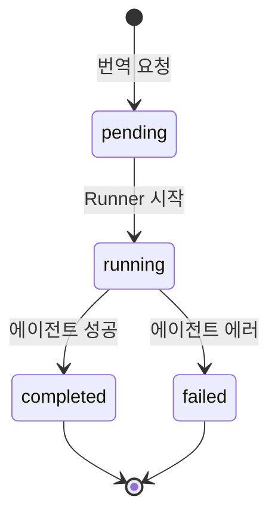
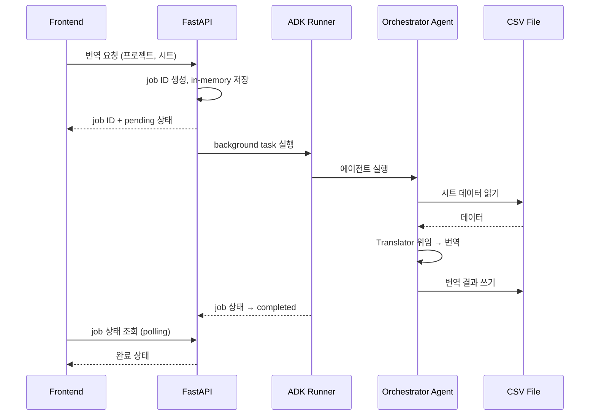

# Backend API

## Goal

FastAPI 서버로 에이전트 실행을 래핑하고, 프로젝트/설정 관리 API를 제공한다.

## Tech Stack

- **Framework**: FastAPI — because Python 에이전트와 동일 런타임, async 지원
- **Data**: 파일 시스템 (YAML + CSV) — because v0에서 DB 불필요, 프로젝트 디렉토리 구조로 충분

## API Groups

- **Projects**: 프로젝트 CRUD, 목록 조회
- **Sheets**: 로컬 CSV 파일에서 시트 목록/데이터 조회 및 수정
- **Translation**: 번역/업데이트/검수 작업 트리거 + 상태 조회 + 결과
- **Config**: 용어집, 스타일가이드, 시트별 컨텍스트 관리

## Architectural Decisions

- **비동기 job 모델** — because 대량 시트 번역은 시간이 오래 걸림. 요청 즉시 job ID 반환, 프론트엔드에서 상태 폴링.
- **In-memory Job 관리 (v0)** — because v0에서 Job 이력 영속화 불필요. 서버 재시작 시 소멸 허용.
- **ADK Runner + DatabaseSessionService (SQLite)** — because 에이전트 대화 히스토리를 영속 저장하여 서버 재시작 후에도 세션 유지. Runner가 SessionService를 주입받아 에이전트를 실행.
- **파일 기반 프로젝트 설정** — because v0에서 DB 도입 불필요. `projects/<name>/` 디렉토리에 config.yaml, glossary.yaml, style_guide.yaml 저장.
- **로컬 CSV 파일로 시트 관리** — because 외부 서비스 의존 없이 `projects/<name>/sheets/*.csv` 파일을 직접 읽기/쓰기. 시트 수(sheet_count)는 CSV 파일 개수에서 동적으로 산출.

## Constraints

- Must: 번역 요청 시 즉시 job ID 반환 (blocking 금지)
- Must: 프로젝트 설정은 `projects/<name>/` 하위 YAML 파일로 관리
- Must: CSV 파일은 `projects/<name>/sheets/` 디렉토리에 저장
- Must not: 에이전트 내부 로직을 API 레이어에서 직접 구현하지 않을 것 (에이전트 호출만)

## Flows

### Job 상태 전이

### 번역 요청 데이터 흐름 (시퀀스)

## Scope

**In scope (v0)**: 프로젝트 CRUD, CSV 시트 조회/수정, 번역 job 실행/상태, 설정 관리
**Out of scope**: 인증, 멀티 유저, 작업 이력 저장

## v0 이후 검토 방향 (확정 아님 — v0 사용 경험 후 결정)

- 사용자 인증 (Google OAuth)
- 작업 이력 / 로그 저장 (Job 관리를 SQLite로 마이그레이션)
- WebSocket으로 실시간 진행률 전송
- 동시 작업 제한 / 큐 관리
- CSV 파일 업로드 API
- Google Sheets 연동 (선택적)
