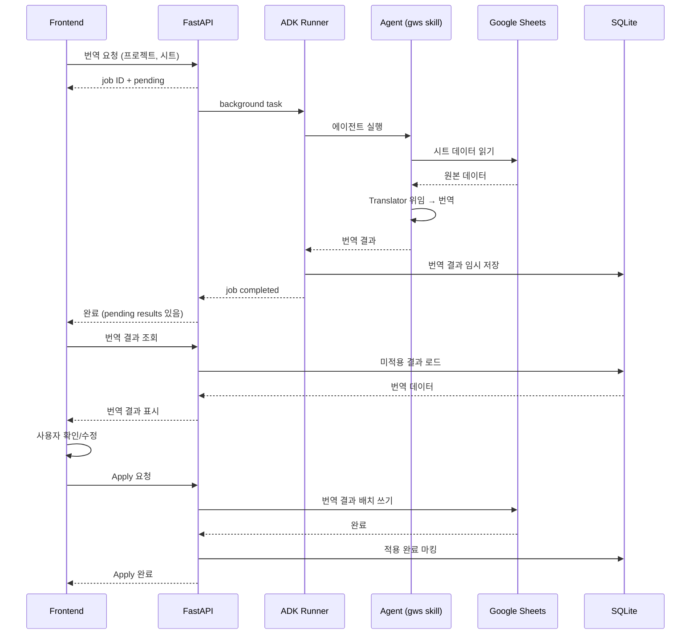

# Google Workspace CLI 연동 — v3

## Goal

로컬 CSV 기반 시트 관리를 Google Sheets로 전환하고, ADK 1.26.0 Skills 체계로 에이전트를 재구성한다.

## Tech Stack

- **Google Sheets 연동**: gws CLI (`@googleworkspace/cli`) — because Google Discovery Service에서 동적 생성되는 CLI로, Sheets API를 별도 Python 래퍼 없이 사용 가능
- **Agent Skills**: ADK 1.26.0 SkillToolset + `adk-skills-agent` — because gws의 SKILL.md를 ADK 에이전트에 직접 로드하여 Gemini가 gws 명령을 자율 실행
- **임시 번역 저장**: SQLite — because v1에서 도입한 Job DB 인프라를 재활용

## Architectural Decisions

### 데이터 소스

- **Google Sheets가 단일 데이터 소스** — because 로컬 CSV와 Google Sheets 양방향 동기화는 충돌 해결 복잡도가 높음. 단일 소스로 정합성 문제 제거. CSV는 export 기능으로만 생성.
- **1 프로젝트 = 1 스프레드시트** — because 기존 구조(1 프로젝트 = 여러 CSV)와 자연스럽게 대응. 스프레드시트 내 탭이 기존 CSV 파일에 대응. config.yaml에 spreadsheet_id 하나만 저장.
- **Google Sheets가 시트 구조의 마스터** — because 데이터 소스가 Google Sheets이면 시트 구조(탭 추가/삭제/이름 변경)도 Google Sheets에서 관리하는 게 일관됨. 프론트엔드는 시트 목록을 읽기 전용으로 가져옴.

### 번역 워크플로우

- **번역 결과는 프론트엔드 확인 후 Apply** — because 에이전트 번역을 바로 Google Sheets에 쓰면 검수 전 데이터가 반영됨. 사용자가 확인/수정 후 Apply 버튼으로 반영하여 품질 관문 추가.
- **미적용 번역은 SQLite에 저장** — because v1 Job SQLite 인프라 재활용. 서버 재시작 후에도 미적용 번역을 잃지 않음.
- **프론트엔드 셀 편집은 배치 + Apply** — because 셀 수정마다 Google Sheets API 호출은 비효율적. 여러 셀 수정 후 Apply 버튼으로 일괄 반영. 번역 Apply와 동일 패턴.

### 기존 프로젝트 호환

- **CSV 프로젝트와 gws 프로젝트 공존** — because 점진적 전환 전략. 프로젝트 설정에서 데이터 소스 유형을 구분. 기존 CSV 프로젝트는 기존 방식 유지, 새 프로젝트부터 gws 선택 가능.

### 인증

- **서버 레벨 gws 인증** — because v0~v2 전체가 인증/멀티유저를 out of scope으로 두고 있음. 서버에 한 번 `gws auth login --scopes sheets` 실행. 사용자별 인증은 Google OAuth 도입 시 전환.

### ADK 에이전트 재구성

- **ADK 1.19.0 → 1.26.0 업그레이드** — because Skills, SkillToolset, 스크립트 실행이 1.25.0+에서 추가됨. gws 스킬 로드에 필수.
- **gws-sheets 스킬을 에이전트에 직접 로드** — because ADK Skills로 gws SKILL.md를 로드하면 Gemini가 gws 명령을 자율 생성·실행. subprocess 래퍼 코드 불필요.
- **기존 CSV 도구와 gws 스킬 공존** — because CSV 프로젝트 호환을 위해 기존 sheets.py 도구 유지. 프로젝트의 source 설정에 따라 에이전트가 사용할 도구/스킬이 결정됨.
- **에이전트 구조를 ADK 1.26.0 Skills 체계로 리팩터링** — because 기존 도구 함수 기반에서 Skills 기반으로 전환하면 도구 모듈화, 컨텍스트 윈도우 최적화, 스킬 재사용 가능.

## Flows

### 번역 → 확인 → Apply 흐름

## Constraints

- Must: gws CLI가 서버 환경에 설치되어 있고 `gws auth login` 완료 상태여야 함
- Must: 프로젝트별 데이터 소스(CSV/Google Sheets)가 설정으로 구분 가능해야 함
- Must: gws 프로젝트에서 번역 결과는 반드시 SQLite 임시 저장 → Apply 경유 → Google Sheets 반영
- Must: 프론트엔드 셀 편집도 Apply 버튼으로 일괄 반영 (즉시 쓰기 금지)
- Must: 기존 CSV 프로젝트는 기존 방식으로 계속 동작 (하위 호환)
- Must not: gws 프로젝트에서 로컬 CSV 파일을 데이터 소스로 사용하지 않을 것
- Must not: 에이전트가 번역 결과를 Google Sheets에 직접 쓰지 않을 것 (Apply 경유 필수)
- Must not: 프론트엔드에서 시트 탭 생성/삭제하지 않을 것 (Google Sheets 마스터)

## Scope

**In scope (v3)**: gws CLI 연동, Google Sheets 읽기/쓰기, ADK 1.26.0 Skills 재구성, 번역 결과 Apply 워크플로우, 프론트엔드 배치 편집 + Apply, CSV/gws 프로젝트 공존

**Out of scope**: 사용자별 Google OAuth, 자동 마이그레이션 도구(CSV→Sheets), Google Sheets에서의 실시간 변경 감지, 오프라인 모드

## v3 이후 검토 방향 (확정 아님 — v3 사용 경험 후 결정)

- 사용자별 Google OAuth 인증
- CSV → Google Sheets 자동 마이그레이션 CLI
- Google Sheets 변경 감지 (webhook / polling)
- 프론트엔드에서 시트 탭 생성/삭제 (Google Sheets 연동)
- 번역 결과 자동 Apply 옵션 (검수 불필요 시)
